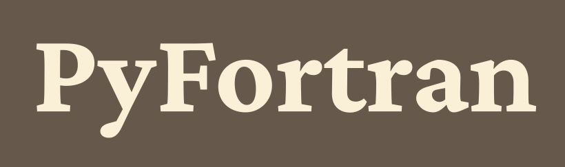

## PyFortran

A Python interpreter for early FORTRAN, i.e. to run programs written for FORTRAN on the IBM 704 and FORTRAN / GOTRAN for the IBM 1620 or FORTRANSIT on the IBM 650

Usage:

  `python pyfortran.py [source file] [input file (optional)]`

### Differences between PyFortran and historical FORTRAN languages

* limited FORMAT support (just for PRINT statements)
* Source code can be in lowercase.
* Arrays can have more than three dimensions.
* Integer division works like in Python (e.g. 3/2 == 1.5 in Python 3, unlike in Python 2 or FORTRAN).
* Completely empty, non-comment lines are allowed.
* STOP or END are optional.
* Jumping out of loops probably causes problems when later entering same loop.
* Loops can use real numbers, not just integers. (But the loop variable can only increase, as in old FORTRAN.)

### Credits

Some Fortran programs were taken from [hughcoleman/retrocomputing](https://github.com/hughcoleman/retrocomputing).

